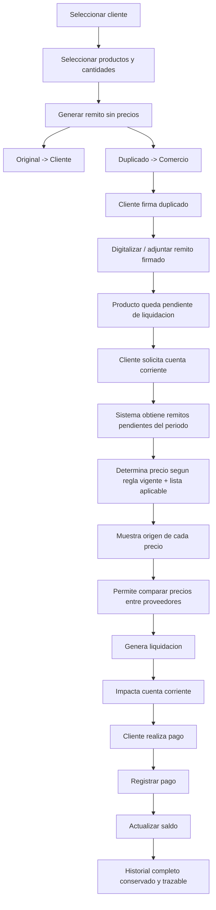

# 01 — Análisis funcional

## 1. Regla de negocio fundamental

**El remito no fija el precio.**

```
Retiro de mercadería (fecha T0)          Liquidación de cuenta (fecha T1 > T0)
────────────────────────────────         ─────────────────────────────────────
Cliente + Productos + Cantidad     →     Se buscan los remitos pendientes
Remito SIN precios                       Se determina el precio vigente
Original → cliente                       según la lista/regla aplicable
Duplicado → comercio, firmado            (que puede ser la de T1, no la de T0
Producto queda PENDIENTE DE LIQUIDAR      — a definir con el negocio, ver §6)
                                          Se registra el importe en la cta. cte.
```

Consecuencia directa sobre el modelo de datos: **fecha de retiro ≠ fecha de
determinación de precio**, y ambas deben quedar registradas de forma
independiente y nunca sobrescribirse (`delivery_notes.issued_at` vs.
`account_settlement_items.price_determined_at` / `pricing_rule` aplicada,
ver `03-modelo-de-datos.md`).

## 2. Actores y roles

| Rol | Puede |
|---|---|
| **Administrador** | Todo, incluyendo gestión de usuarios/roles, reglas de precio, anulaciones, backups |
| **Vendedor** | Consultar clientes/productos, generar remitos, buscar precios de referencia (no necesariamente el costo), no liquida ni cobra |
| **Administración** | Liquidar cuentas, registrar pagos, importar listas, administrar cuentas corrientes, no gestiona usuarios/roles |

RBAC modelado como `users` ⇄ `roles` ⇄ `permissions` (muchos a muchos en
ambos extremos) para poder crear roles adicionales sin tocar código
(supervisor, solo-lectura, depósito cuando exista stock, etc.).

## 3. Requisitos funcionales (por módulo)

- **Clientes**: alta/baja/modificación, ficha con cuenta corriente completa (saldo, movimientos, remitos, liquidaciones, pagos), búsqueda por código/nombre/CUIT.
- **Proveedores**: alta/baja/modificación, listas de precios asociadas, mapeos de importación guardados por proveedor.
- **Productos**: catálogo maestro + referencias por proveedor (código y descripción originales, nunca sobrescritos), categorías/subcategorías, búsqueda tolerante a variaciones de escritura.
- **Importación de listas Excel**: detección automática de columnas, mapeo editable y reutilizable, previsualización con detección de anomalías, informe de resultado, conservación del archivo original.
- **Catálogo unificado / comparador de precios**: ver todos los precios de un producto por proveedor, mejor costo, variación vs. lista anterior.
- **Motor de precios**: reglas configurables de margen/gastos/IVA, versionadas, nunca aplicadas retroactivamente sobre historial ya liquidado.
- **Remitos**: emisión rápida sin precios, original/duplicado, adjunto del remito firmado, estados, anulación con motivo.
- **Cuenta corriente**: libro de movimientos (remitos pendientes, liquidaciones, pagos, ajustes), saldo siempre trazable a sus movimientos.
- **Liquidación**: selección de remitos pendientes, cálculo de precio con trazabilidad completa del origen, comparador de precios in-line, confirmación explícita (nunca silenciosa si hay productos sin precio).
- **Pagos**: registro por medio de pago, impacto automático y transaccional en cuenta corriente, anulación con reverso contable (nunca borrado).
- **Auditoría**: registro de quién/cuándo/qué para toda operación sensible (precios, liquidaciones, remitos, anulaciones, pagos, clientes).
- **Dashboard**: indicadores + alertas operativas (ver `05-ux-api-testing-plan.md`).
- **Buscador global**: cliente/remito/producto/código/cuenta/proveedor en una sola caja de búsqueda.
- **Reportes y exportaciones**: PDF/Excel/CSV para clientes, productos, remitos, cuentas.

## 4. Requisitos no funcionales

| Categoría | Requisito |
|---|---|
| Concurrencia | Múltiples vendedores/administrativos simultáneos sin duplicar numeración, sin doble liquidación, sin doble pago |
| Integridad | Ningún registro histórico se sobrescribe; toda corrección es un nuevo registro o una anulación con reverso |
| Performance | Búsqueda de producto/cliente/remito con respuesta subsegundo con catálogos de cientos de miles de filas |
| Seguridad | Auth robusta, RBAC, validación de entradas, protección de uploads, auditoría, backups |
| Disponibilidad de evidencia | Todo remito firmado y comprobante de pago debe quedar recuperable desde la cuenta corriente del cliente |
| Escalabilidad | Arquitectura modular preparada para stock, compras, facturación, multi-sucursal, WhatsApp/Mercado Pago/ARCA, sin reescritura |

## 5. Casos de uso principales

1. **Emitir remito**: vendedor busca cliente → agrega productos por código/descripción y cantidad → confirma → sistema genera número atómico → genera PDF original y duplicado sin precios → queda en estado `EMITIDO`.
2. **Adjuntar remito firmado**: administración escanea/fotografía el duplicado firmado y lo adjunta al remito → estado pasa a `FIRMADO`.
3. **Importar lista de precios**: administración sube Excel de un proveedor → sistema detecta/propone mapeo de columnas → usuario confirma → preview con anomalías → confirma importación → catálogo unificado y referencias de proveedor se actualizan, lista y archivo original quedan conservados.
4. **Comparar precios de un producto**: usuario busca producto → ve precio por proveedor, mejor costo, fecha de lista, variación %.
5. **Liquidar cuenta corriente**: administración selecciona cliente/período → sistema lista remitos pendientes → resuelve precio de cada ítem según la regla vigente aplicable → muestra origen completo de cada precio → permite comparar contra otros proveedores → confirma → se genera liquidación y movimiento de cuenta corriente → remitos incluidos pasan a `LIQUIDADO`.
6. **Registrar pago**: administración registra pago de un cliente → impacta cuenta corriente → saldo se actualiza.
7. **Consultar remito firmado desde la cuenta corriente**: cliente → movimiento → remito → documento adjunto.
8. **Anular remito/liquidación/pago**: cambia de estado, nunca se borra, exige motivo y queda auditado; si el remito ya está `LIQUIDADO`, primero debe anularse (reversarse) la liquidación asociada.

## 6. Flujo de negocio completo



## 7. Riesgos y mitigaciones

| Riesgo | Mitigación |
|---|---|
| Doble numeración de remitos con múltiples vendedores | Contador transaccional con bloqueo de fila (`SELECT ... FOR UPDATE`), nunca `MAX(numero)+1` |
| Excel de proveedor con formato distinto rompe la importación | Mapeo de columnas asistido + guardado por proveedor, validación de calidad antes de aplicar |
| Producto sin precio al momento de liquidar | Liquidación nunca se genera "silenciosamente incompleta"; se bloquea y se ofrece resolución explícita (ver `04-importacion-y-precios.md §5`) |
| Pérdida de trazabilidad al actualizar precios/reglas | Todo cambio de precio o de regla crea una fila nueva (versionado), nunca `UPDATE` sobre el valor histórico |
| Doble liquidación o doble pago con usuarios concurrentes | Transacciones de base de datos + bloqueo optimista/pesimista sobre remitos y liquidaciones en curso |
| Disputa sobre mercadería entregada | Remito firmado digitalizado, siempre recuperable desde la cuenta corriente |
| Fórmula de precio mal asumida por el equipo técnico | Fórmula documentada explícitamente y **pendiente de validación con el negocio** antes de implementarse (ver §8) |

## 8. Decisiones pendientes de confirmar con el negocio

Estas preguntas **deben responderse antes de fijar el motor de precios y la
numeración definitiva** (no se asumen criterios sin documentarlos, ítem 13
del brief):

1. Al liquidar, ¿se usa la lista de precios **vigente al momento de la
   liquidación**, o una regla distinta (p. ej. "la lista vigente al momento
   del retiro" o "la más antigua entre las dos")? El brief (§2) sugiere la
   primera opción; se implementará así salvo indicación contraria, quedando
   la fecha de referencia como parámetro configurable por cliente/operación.
2. Margen: ¿se calcula sobre costo o sobre precio de venta? ¿Gastos e IVA se
   aplican en cascada sobre el resultado anterior o cada uno sobre el costo
   base? (Propuesta documentada en `04-importacion-y-precios.md §6`, a
   confirmar).
3. Redondeo: ¿a qué unidad (peso, decena, centena) y hacia qué lado (arriba,
   más cercano)?
4. Moneda: ¿todo en ARS? ¿Hay proveedores con listas en USD que requieran
   tipo de cambio?
5. Numeración de remitos: ¿una única serie o series por punto de venta /
   vendedor? ¿Requiere correlatividad fiscal (AFIP/ARCA) o es puramente
   interna (dado que no es un comprobante fiscal)?
6. Límite de crédito por cliente: ¿es solo informativo (alerta) o debe
   bloquear la emisión de nuevos remitos al superarse?

Estas decisiones no bloquean el desarrollo de los módulos base (clientes,
productos, importación, remitos), pero sí deben resolverse antes de dar por
cerrado el motor de precios y la liquidación (Fase 2/4 del plan, ver
`05-ux-api-testing-plan.md`).

## 9. Regla maestra para cambios futuros

Todo requerimiento nuevo se analiza en este orden antes de tocar código:

1. Módulos afectados. 2. Tablas afectadas. 3. Procesos afectados (anteriores
y posteriores). 4. Posibles regresiones. 5. Impacto explicado al usuario.
6. Implementación. 7. Pruebas unitarias/integración. 8. Pruebas de
regresión. 9. Confirmación de que lo existente sigue funcionando.

Ningún cambio se considera terminado sin cumplir el criterio de "terminado"
definido en `05-ux-api-testing-plan.md §4`.
