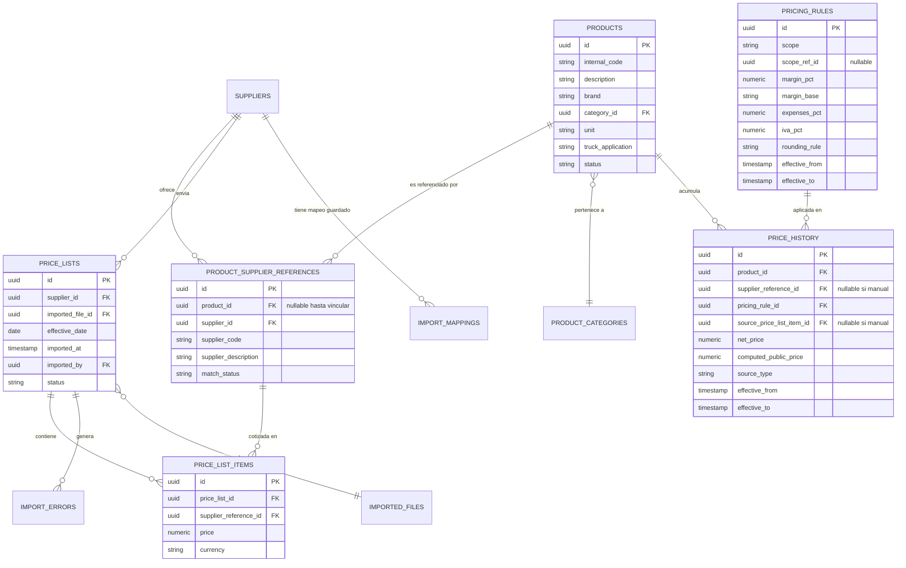
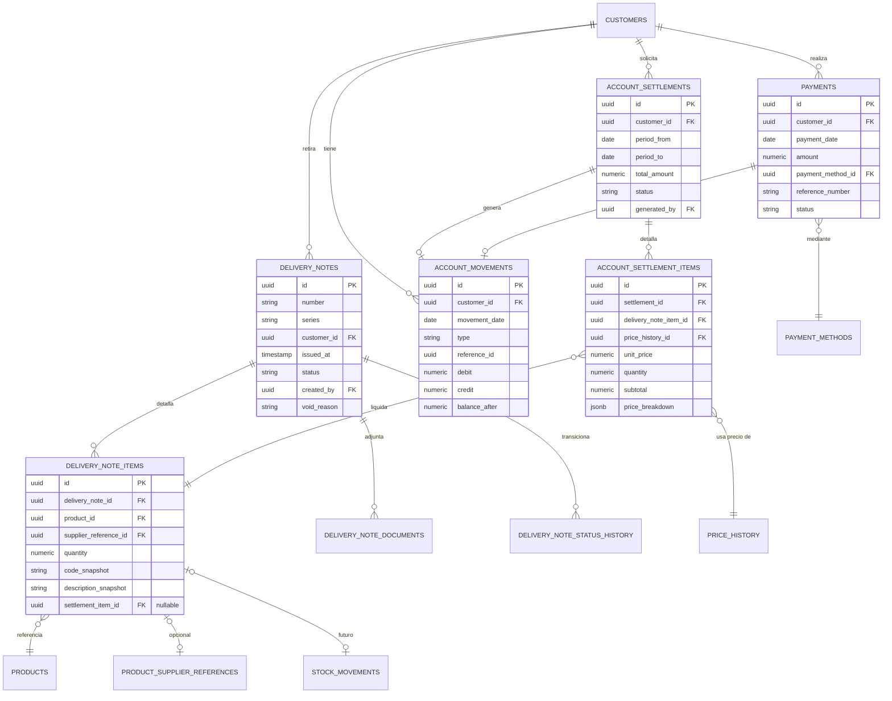
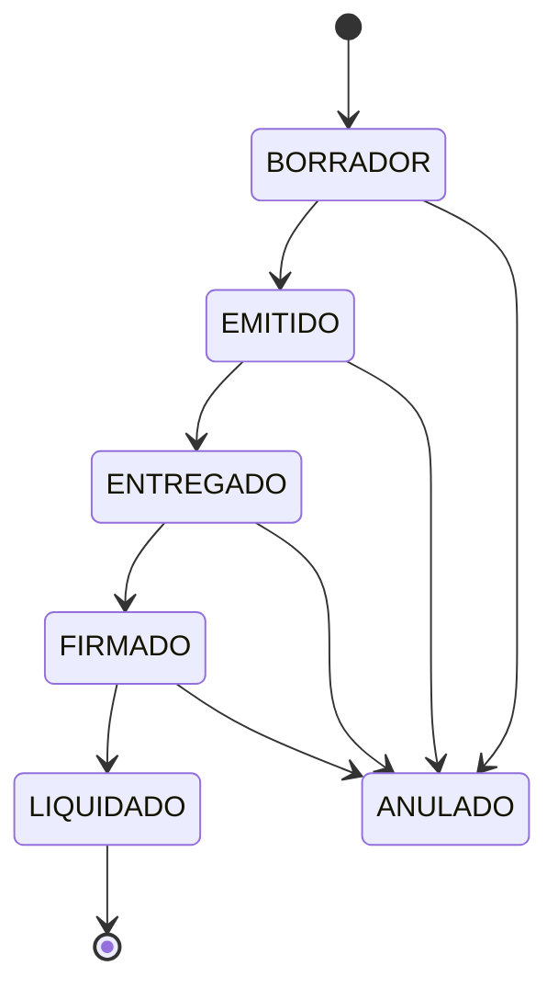
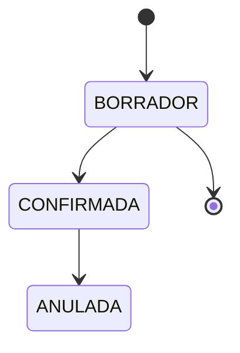
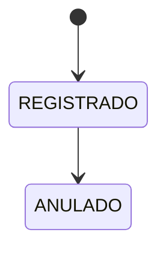
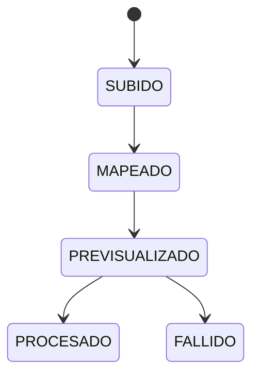

# 03 — Modelo de datos

Base de datos relacional (PostgreSQL), normalizada, con integridad
referencial estricta. Regla transversal: **nada que forme parte del
historial se actualiza in-place**; se versiona con `effective_from` /
`effective_to` o se marca como anulado, nunca se borra.

## 1. Diagrama entidad-relación — catálogo y precios

## 2. Diagrama entidad-relación — comercial (remitos, cuenta corriente, pagos)

## 3. Definición de tablas

> Convención: toda tabla incluye `id UUID PK`, `created_at`, `updated_at`
> salvo indicación contraria. Las tablas marcadas **[append-only]** no
> permiten `UPDATE` de sus columnas de negocio, solo `INSERT` (más un
> `effective_to` para cerrar vigencia cuando corresponda).

### Identidad y permisos
- **users**: email, password_hash, full_name, status (activo/inactivo).
- **roles**: name, description.
- **permissions**: code (`customers.read`, `settlements.create`, …), description.
- **role_permissions** (N:M roles↔permissions).
- **user_roles** (N:M users↔roles) — permite más de un rol por usuario, RBAC ampliable.

### Clientes y proveedores
- **customers**: internal_code, business_name, cuit, dni, phone, whatsapp, email, address, city, province, commercial_condition, credit_limit, status, notes, created_at.
  - Índices: `internal_code` único, `business_name` (trigram), `cuit`.
- **suppliers**: code, name, cuit, contact_info, status.

### Productos
- **product_categories**: name, parent_id (self-FK, nullable) → soporta subcategorías sin tabla aparte.
- **products** (catálogo maestro): internal_code, description, brand, category_id FK, unit, truck_application, status, notes.
  - Índices: `internal_code` único, `description` (trigram + `unaccent`) para búsqueda tolerante.
- **product_supplier_references**: product_id FK **nullable** (una referencia puede llegar sin vincular todavía a un maestro), supplier_id FK, supplier_code, supplier_description (valores **originales**, nunca reescritos), match_status (`UNMATCHED`/`MATCHED`/`IGNORED`), matched_by, matched_at.
  - Único: (`supplier_id`, `supplier_code`).
  - Esto resuelve el requisito del ítem 7: el maestro nunca pisa el dato original del proveedor.

### Importación de listas
- **imported_files**: supplier_id FK, original_filename, storage_key, sha256_hash, uploaded_by, uploaded_at. Conserva el Excel tal cual se recibió, para auditoría.
- **import_mappings**: supplier_id FK, column_mapping (JSONB: `{code: "SKU", description: "Detalle", price: "Costo Neto"}`), detected_headers (JSONB), updated_by, updated_at. Uno vigente por proveedor; el historial de cambios de mapeo va a `audit_logs`.
- **price_lists**: supplier_id FK, imported_file_id FK, effective_date, imported_at, imported_by, status (`PROCESSED`/`PARTIAL`/`FAILED`), notes. **[append-only]** — cada import es un lote nuevo, nunca se reprocesa sobre el mismo lote.
- **price_list_items** **[append-only]**: price_list_id FK, supplier_reference_id FK, price, currency. Es, en sí misma, el historial de precios de lista (nunca se actualiza un ítem ya importado; una lista nueva es un lote nuevo).
- **import_errors**: price_list_id FK, row_number, raw_data (JSONB), error_type, error_message. Permite descargar el detalle de errores (ítem 27, paso 10).

### Precios y márgenes
- **pricing_rules** **[append-only, versionada]**: scope (`GLOBAL`/`CATEGORY`/`SUPPLIER`/`PRODUCT`), scope_ref_id (nullable), margin_pct, margin_base (`COST`/`SALE_PRICE`), expenses_pct, expenses_fixed, iva_pct, rounding_rule, effective_from, effective_to (`NULL` = vigente), created_by. Una regla nueva cierra (`effective_to`) la anterior del mismo scope; nunca se edita una regla ya usada en una liquidación.
- **price_history** **[append-only]**: product_id FK, supplier_reference_id FK (nullable si el precio fue manual), pricing_rule_id FK, source_price_list_item_id FK (nullable si manual), net_price, computed_public_price, source_type (`LIST_IMPORT`/`MANUAL`), manual_reason / manual_authorized_by (si aplica), effective_from, effective_to. Es la tabla que responde "¿qué precio hubiera calculado el sistema para este producto en la fecha X?" sin tener que recomputar cruces entre `price_list_items` y `pricing_rules` cada vez.

### Remitos
- **delivery_notes**: number, series, customer_id FK, issued_at, status (`BORRADOR`/`EMITIDO`/`ENTREGADO`/`FIRMADO`/`LIQUIDADO`/`ANULADO`), created_by, void_reason, voided_by, voided_at.
  - Único: (`series`, `number`).
- **delivery_note_items**: delivery_note_id FK, product_id FK, supplier_reference_id FK (nullable), quantity, unit, code_snapshot, description_snapshot (copia del código/descripción vigente al emitir, para que el remito impreso no cambie si el maestro se edita después), settlement_item_id FK nullable (se completa al liquidar), stock_movement_id FK nullable (**preparado para el futuro módulo de stock**, sin lógica bloqueante hoy).
- **delivery_note_documents**: delivery_note_id FK, type (`ORIGINAL_PDF`/`DUPLICADO_PDF`/`FIRMADO_SCAN`), storage_key, uploaded_by, uploaded_at.
- **delivery_note_status_history**: delivery_note_id FK, from_status, to_status, changed_by, changed_at, reason (nullable). Auditoría específica de la máquina de estados.
- **document_counters**: doc_type, series, year, last_number — usado transaccionalmente para numerar (ver `02-arquitectura.md §4`).

### Cuenta corriente
- **account_movements** **[append-only]**: customer_id FK, movement_date, type (`REMITO_PENDIENTE`/`LIQUIDACION`/`PAGO`/`AJUSTE`), reference_type, reference_id, debit, credit, balance_after, created_by. El saldo del cliente siempre se puede recalcular sumando esta tabla; `balance_after` se graba en la misma transacción como cache de lectura.
- **account_settlements**: customer_id FK, period_from, period_to, total_amount, status (`BORRADOR`/`CONFIRMADA`/`ANULADA`), generated_by, voided_by, voided_at, void_reason.
- **account_settlement_items**: settlement_id FK, delivery_note_item_id FK, price_history_id FK, unit_price, quantity, subtotal, margin_pct_applied, expenses_pct_applied, iva_pct_applied, price_breakdown (JSONB con el detalle completo mostrado en pantalla: proveedor, lista, fecha, regla). Esta tabla **es** la trazabilidad exigida en el ítem 47.

### Pagos
- **payment_methods**: name, requires_reference (bool), active.
- **payments**: customer_id FK, payment_date, amount, payment_method_id FK, reference_number, notes, created_by, status (`REGISTRADO`/`ANULADO`), voided_by, voided_at, void_reason.

### Auditoría
- **audit_logs** **[append-only]**: user_id FK, occurred_at, module, entity_type, entity_id, action, old_value (JSONB), new_value (JSONB), reason, ip_address.

### Preparado para stock (futuro, no bloqueante)
- **stock_movements** (tabla mínima, sin validaciones de negocio activas todavía): product_id FK, delivery_note_item_id FK nullable, movement_type, quantity, warehouse_id nullable, movement_date, created_by, status. Existe la relación desde `delivery_note_items`, pero **no se activa control de stock en esta etapa** (ítem 40/41 del brief: preparar sin implementar).

## 4. Índices clave (además de las PK/FK)

- `products (internal_code)`, `products USING gin (description gin_trgm_ops)`.
- `product_supplier_references (supplier_id, supplier_code)`.
- `customers USING gin (business_name gin_trgm_ops)`, `customers (cuit)`.
- `delivery_notes (customer_id, status)`, `delivery_notes (series, number)` único.
- `account_movements (customer_id, movement_date)`.
- `price_history (product_id, effective_from)`.
- `audit_logs (entity_type, entity_id, occurred_at)`.

## 5. Máquinas de estado

### Remito

Un remito `LIQUIDADO` **no puede anularse directamente**: primero debe
anularse la liquidación que lo incluye (lo que lo devuelve a `FIRMADO`/
`ENTREGADO`), y recién ahí puede anularse el remito. Esto evita romper la
trazabilidad de una liquidación ya confirmada.

> **Estado: implementado (Fase 3)**, en
> `backend/src/modules/delivery-notes/`. Simplificaciones respecto de este
> diseño: no se modela el paso `BORRADOR` (el remito nace directamente en
> `EMITIDO`, ver justificación en `DeliveryNotesService`); adjuntar el
> remito firmado desde `EMITIDO` registra automáticamente el paso por
> `ENTREGADO` en el mismo movimiento (ambas transiciones quedan igual de
> auditadas en `delivery_note_status_history`); y los PDF `ORIGINAL`/
> `DUPLICADO` se generan on-demand con `pdf-lib` en vez de persistirse como
> `delivery_note_documents` (son derivables determinísticamente de los
> `code_snapshot`/`description_snapshot` ya congelados, así que no hace
> falta guardarlos — solo el `FIRMADO_SCAN`, que sí es un archivo externo,
> se persiste). Motor de numeración transaccional (`document_counters`)
> extendido para poder compartir la transacción con el llamador (ver
> `DocumentCountersService.getNextNumber`), de forma que reservar el
> número y crear el remito sean una única operación atómica.

### Liquidación

`CONFIRMADA` genera el movimiento en `account_movements` y marca los
`delivery_note_items` incluidos (y su remito, si están todos sus ítems) como
`LIQUIDADO`. `ANULADA` genera un movimiento de reverso (nunca borra el
original) y devuelve los remitos afectados a su estado previo.

> **Estado: implementado (Fase 4)**, en `backend/src/modules/accounts/`.
> El precio de cada ítem se resuelve al momento de **crear** el borrador
> (no al confirmarlo) contra `price_history`, eligiendo por defecto el de
> mejor costo entre todos los proveedores vigentes para ese producto
> (`resolvePriceCandidates`); el resto de los candidatos queda igual
> disponible en `price_breakdown.alternativeCandidates` para el
> comparador, aunque la selección automática del mejor costo — sin una UI
> para elegir manualmente otro proveedor — es una simplificación de esta
> fase. Ya en el borrador se fija `delivery_note_items.settlement_item_id`
> (no recién al confirmar), para que dos liquidaciones concurrentes nunca
> puedan tomar el mismo remito; si el borrador se anula, se libera. El
> saldo de `account_movements` se calcula con un bloqueo de fila del
> cliente (`SELECT ... FOR UPDATE` sobre `customers`) dentro de la misma
> transacción que crea el movimiento, verificado con dos confirmaciones de
> liquidación concurrentes reales sin pérdida de actualización.

### Pago

`ANULADO` genera un movimiento contrario en `account_movements`.

> **Estado: implementado (Fase 5)**, en `backend/src/modules/payments/`.
> Reutiliza el mismo `AccountMovementsService` de Liquidación (Fase 4) —
> un pago y una liquidación son, para el libro de movimientos, la misma
> operación (crear un movimiento con bloqueo de fila del cliente), solo
> cambia el signo (crédito en vez de débito) y el `reference_type`. Un
> medio de pago puede marcarse para exigir número de comprobante
> (`payment_methods.requires_reference` — los medios sembrados por defecto
> no lo exigen, es configurable por medio); si lo exige y no se informa,
> se rechaza antes de crear el pago.

### Importación de lista de precios

## 6. Por qué no hay una tabla "genérica" de más

Se evaluó agregar `customer_contacts`, `document_series_config` y
`category_attributes` separadas, pero **no se incorporan** porque no surge
una relación N:M ni un caso de uso concreto todavía (ítem 34: "no crear
tablas solamente porque aparecen en la lista"). Si en el futuro un cliente
necesita múltiples contactos o un producto necesita atributos dinámicos por
categoría, se agregan en ese momento con su propia migración.
