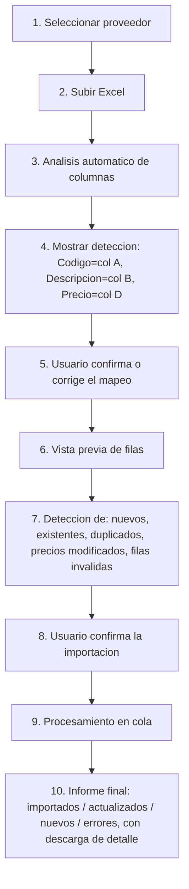

# 04 — Importación inteligente de Excel y motor de precios

## 1. Flujo de importación (experiencia de usuario)



Pasos 1–2 y 9 son sincrónicos vía API; el procesamiento real (paso 9) se
delega a un worker (BullMQ) para no bloquear la request cuando el Excel
tiene decenas de miles de filas, y el frontend hace polling/estado del job.

## 2. Detección automática de columnas

1. Se leen los encabezados de la hoja (primera fila no vacía).
2. Cada encabezado se normaliza: minúsculas, sin tildes (`unaccent`), sin
   espacios/puntuación redundante.
3. Se compara contra un diccionario de sinónimos por campo canónico:

   | Campo canónico | Sinónimos reconocidos |
   |---|---|
   | `code` | codigo, código, cod, sku, codigo producto, cod. producto, id producto |
   | `description` | descripcion, detalle, producto, denominacion, articulo |
   | `price` | precio, precio neto, costo, costo neto, precio lista, importe |
   | `alt_code` (opcional) | codigo alternativo, codigo original, oem, cross reference |

4. Coincidencia exacta de sinónimo → confianza alta (auto-asignado).
   Si no hay exacta, similitud de texto (distancia de Levenshtein /
   trigram similarity) contra el diccionario → confianza media (se
   propone, pero se resalta para revisión).
5. Si el proveedor ya tiene un `import_mappings` guardado, se aplica
   directamente y se salta al paso 6 (vista previa), permitiendo igual
   editarlo si el archivo cambió de formato.
6. El usuario confirma o corrige manualmente cada asignación (paso 5 del
   flujo). Al confirmar, se actualiza (nueva versión de) `import_mappings`
   para ese proveedor — así la próxima lista del mismo proveedor se
   procesa automáticamente.

Este mecanismo es agnóstico del layout exacto: resuelve los tres ejemplos
del brief (`Código|Descripción|Precio`, `Código Producto|Detalle|Precio
Neto`, `SKU|Producto|Costo`) sin código específico por proveedor.

No todos los proveedores envían una fila de encabezados de texto
reconocible (hay casos reales sin ninguna fila "Código/Descripción/Precio"
y con varias listas dentro del mismo archivo, una por hoja): el mecanismo
completo de detección de inicio de tabla y el modo de mapeo por posición
de columna se describen en el caso real §9.

## 3. Control de calidad antes de aplicar (bloquea la importación silenciosa)

Antes de confirmar la importación se ejecutan validaciones y se muestran
como resumen accionable (no solo un log):

- Códigos duplicados dentro del mismo archivo.
- Filas con código vacío o descripción vacía.
- Precio negativo, cero, o no numérico.
- Filas completamente duplicadas.
- Variación de precio extrema respecto del último precio conocido de ese
  proveedor+código (umbral configurable, p. ej. ±40%) → se marca como
  advertencia, no bloquea, pero requiere confirmación explícita.
- Columnas presentes en el archivo que no fueron mapeadas a ningún campo
  canónico → se informan, no se descartan silenciosamente.
- **Filas de sección/categoría no cuentan como filas inválidas** (código y
  precio vacíos pero con texto descriptivo): se reconocen como
  encabezado de categoría, no se listan en `import_errors` — ver caso real
  §9.1.

Las filas inválidas van a `import_errors` con el detalle de la fila cruda y
el motivo; el resto de la lista se procesa igual (la importación es
parcial y transparente, nunca "todo o nada" silencioso, ni "ignora el error
y sigue" sin dejar rastro).

## 4. Qué pasa con cada fila válida al confirmar

1. Se busca `product_supplier_references` por (`supplier_id`,
   `supplier_code`). Si no existe, se crea con `match_status = UNMATCHED`
   (código y descripción **tal cual vienen del proveedor**, sin tocar).
2. Se inserta una fila nueva en `price_list_items` (nunca se actualiza una
   fila de una lista anterior).
3. Si la referencia ya está vinculada a un `product` maestro
   (`match_status = MATCHED`), se dispara el recálculo de
   `price_history` para ese producto con la regla de precio vigente
   (ver §6), dejando `effective_to` a la fila anterior de `price_history`
   para ese producto/proveedor y agregando la nueva.
4. Si la referencia todavía no está vinculada a un maestro
   (`UNMATCHED`), queda disponible en el catálogo unificado como
   "producto sin vincular" — buscable, pero pendiente de que un usuario la
   asocie a un producto maestro (o cree uno nuevo a partir de ella).

## 5. Vinculación producto maestro ↔ referencias de proveedor

- Nunca automática y silenciosa cuando hay ambigüedad: el sistema **sugiere**
  candidatos de producto maestro para una referencia nueva usando similitud
  de texto sobre la descripción (`pg_trgm`) y coincidencia de código
  alternativo si existe, pero la vinculación la confirma un usuario.
- Una vez vinculada, la referencia sigue conservando su código/descripción
  originales; el maestro es una capa adicional, no un reemplazo (ítem 7).
- La búsqueda tolerante ("bomba agua" encuentra "BOMBA DE AGUA", "BBA
  AGUA", "BOMBA AGUA MB") se resuelve con índices `gin_trgm_ops` +
  `unaccent` sobre `products.description` **y** sobre
  `product_supplier_references.supplier_description`, así el producto se
  encuentra tanto por su nombre maestro como por cualquier variante de
  proveedor.

## 6. Motor de precios y márgenes

### 6.1 Modelo de reglas (`pricing_rules`)

Cada regla tiene un alcance (`scope`): `GLOBAL`, `CATEGORY`, `SUPPLIER` o
`PRODUCT`, y se resuelve la más específica vigente para un producto dado en
una fecha dada (PRODUCT > CATEGORY > SUPPLIER > GLOBAL). Una regla nunca se
edita: una modificación cierra la vigente (`effective_to = ahora`) y crea
una nueva (`effective_from = ahora`), de forma que una liquidación pasada
siempre pueda reconstruirse con la regla que realmente estaba vigente ese
día (ver `03-modelo-de-datos.md`).

Campos configurables por regla: `margin_pct`, `margin_base`
(`COST`|`SALE_PRICE`), `expenses_pct`, `expenses_fixed`, `iva_pct`,
`rounding_rule`.

### 6.2 Fórmula propuesta (⚠️ pendiente de confirmación con el negocio)

Siguiendo el ítem 13 del brief ("no asumir criterios contables/comerciales
sin documentarlos"), se propone esta fórmula como **default documentado**,
a validar antes de ir a producción:

```
base            = costo (precio neto de la lista del proveedor vigente)
con_margen      = margin_base == COST
                    ? base * (1 + margin_pct)
                    : base / (1 - margin_pct)          # margen sobre precio de venta
con_gastos      = con_margen * (1 + expenses_pct) + expenses_fixed
precio_final    = con_gastos * (1 + iva_pct)            # si el costo no incluye IVA
precio_final    = redondear(precio_final, rounding_rule)
```

Ejemplo con costo $100.000, margen 30% (sobre costo), gastos 10%, IVA 21%:

```
con_margen   = 100.000 * 1.30 = 130.000
con_gastos   = 130.000 * 1.10 = 143.000
precio_final = 143.000 * 1.21 = 173.030
redondeo     = a la centena más cercana → 173.000 (regla de ejemplo)
```

Cada uno de estos supuestos (orden de aplicación margen→gastos→IVA, sobre
qué base se calcula el margen, si el costo del proveedor ya incluye IVA, y
la regla de redondeo) **debe confirmarse explícitamente con el dueño del
negocio antes de fijarse como comportamiento por defecto**; hasta entonces
se implementa como configuración editable (no hardcodeada) para poder
ajustarla sin tocar código, y cada liquidación queda con el detalle
(`price_breakdown` JSONB) de qué fórmula y qué porcentajes se usaron
realmente.

### 6.3 Comparador de precios entre proveedores

Para un producto maestro, se listan todas las `product_supplier_references`
vinculadas con su último `price_list_item` vigente, ordenadas por precio,
señalando el mínimo ("mejor costo") y, para cada uno: proveedor, fecha de
lista, fecha de actualización, variación % vs. la lista anterior del mismo
proveedor. Este mismo componente se reutiliza dentro de la pantalla de
liquidación (ítem 20 del brief) para comparar el precio efectivamente usado
contra el mejor disponible en ese momento.

## 7. Trazabilidad total

Cadena reconstruible para cualquier ítem liquidado
(`account_settlement_items` → …):

```
Cliente → Remito → Detalle del remito → Producto → Referencia de proveedor
   → Price list item (proveedor + fecha de lista) → Price history
   (regla de precio + fecha de vigencia) → account_settlement_item
   (precio final, breakdown, usuario que liquidó)
```

Toda esta cadena existe porque cada eslabón tiene FK explícita hacia el
anterior y ninguno se sobrescribe; no requiere reconstrucción heurística.

## 8. Producto sin precio al momento de liquidar

No se inventa un precio. Si no existe `price_history` vigente para un
producto en la fecha de liquidación, la pantalla de liquidación:

1. Marca el ítem como "sin precio disponible" y **no permite confirmar** la
   liquidación mientras queden ítems en ese estado (a menos que se
   excluyan explícitamente del lote, quedando pendientes para una
   liquidación posterior).
2. Ofrece: buscar precio de otro proveedor para ese producto, cargar un
   precio manual (requiere permiso/autorización, y registra usuario, fecha,
   motivo, precio y fuente en `price_history.source_type = MANUAL`), o
   dejarlo pendiente e informar al administrador.

Esto implementa el ítem 46 sin excepciones silenciosas.

## 9. Caso real analizado: listas MERCOSIL (multi-hoja)

Se analizó un archivo real de un proveedor (`MERCOSIL_LISTAS_DE_PRECIOS`)
que obliga a afinar el diseño anterior. Estructura encontrada:

- **4 hojas en un mismo archivo**: `LPG`, `IMPORTADOS`, `FEY`,
  `AMORTIGUADORES` — cada una es una **lista de precios independiente**
  (rubro/marca propia), con su propia fecha de vigencia y, en dos de las
  cuatro, su propia moneda.
- **Bloque de metadata antes de la tabla** (no tabular): título "LISTA DE
  PRECIOS", subtítulo de rubro, "VIGENCIA / DESDE EL 24/08/2026",
  condiciones de venta, aviso de moneda ("Precios netos expresados en
  dólares... tipo de cambio vendedor del Banco Nación"), aviso "no
  incluyen I.V.A.", datos de contacto. La tabla de ítems empieza recién
  después de este bloque (en este archivo, entre la fila 50 y 54 según la
  hoja).
- **No existe una fila de encabezados de columna** tipo "Código |
  Descripción | Precio": la tabla arranca directo en filas de datos.
  Columna A = código, B = descripción, C = precio, por **posición**, no
  por texto de encabezado.
- **Filas de categoría/subcategoría intercaladas** dentro de la tabla (ej.
  `FRENOS`, `ARANDELAS DE LEVA DE FRENO`, `BUJES VARIOS DE CRUCETA Y LEVA
  DE FRENO`): solo tienen texto en la columna de descripción, sin código
  ni precio.
- **Formato de precio heterogéneo entre hojas**: número flotante con ruido
  de coma flotante (`332.40374999999995`), número entero en USD (`160`), o
  string con formato moneda (`"$ 121,271.26"`, con símbolo y separador de
  miles).

### 9.1 Ajustes de diseño que este caso confirma como necesarios

1. **Un archivo puede producir varias `price_lists`.** El modelo ya lo
   soporta (`imported_files 1—N price_lists`, ver
   `03-modelo-de-datos.md`): el wizard de importación debe listar las
   hojas del archivo y dejar elegir cuáles importar (por defecto, todas),
   creando un `price_list` por hoja, cada uno con su propia
   `effective_date` y moneda.
2. **Detección de tabla en dos fases**, no "encabezado en la fila 1":
   primero se busca la fila de inicio de datos (heurística: primera fila
   donde, mirando un lote de filas siguientes, una columna es
   predominantemente numérica de forma sostenida), y recién ahí se intenta
   mapear encabezados de texto. Si no hay encabezados de texto plausibles
   en esa fila (como en este caso), el mapeo cae a **modo posicional**
   (columna 1/2/3 = código/descripción/precio), que el usuario puede
   corregir manualmente y guardar como `import_mappings` para ese
   proveedor (ej. `{"mode": "positional", "code": "A", "description": "B",
   "price": "C"}`).
3. **Filas de sección no son errores.** Una fila sin código y sin precio
   pero con texto en la columna de descripción se reconoce como
   encabezado de categoría/subcategoría, no se manda a `import_errors`, y
   opcionalmente alimenta `product_categories`/`subcategory` de los ítems
   que le siguen hasta la próxima fila de sección.
4. **Normalización de precio** debe soportar: valor numérico directo,
   valor numérico con ruido decimal (redondear a 2 decimales al
   persistir), y string con símbolo de moneda/separador de miles
   (`"$ 121,271.26"` → `121271.26`), detectando el separador decimal según
   corresponda.
5. **Extracción asistida de metadata de cabecera**: la fecha de vigencia
   ("DESDE EL 24/08/2026") y la moneda ("expresados en pesos/dólares") se
   proponen automáticamente como valores de `price_lists.effective_date` y
   `currency` a partir del texto del bloque de metadata (patrón "DESDE EL
   \<fecha\>" y "expresados en \<moneda\>"), pero **siempre editables por
   el usuario antes de confirmar** — nunca se asumen en silencio.
6. Confirma el supuesto ya documentado en §6.2 de que el costo del
   proveedor **no incluye IVA** (viene declarado explícitamente en el
   texto del proveedor).

Este caso queda como fixture de referencia para las pruebas unitarias del
parser de importación (Fase 2 del plan, ver `05-ux-api-testing-plan.md`).
